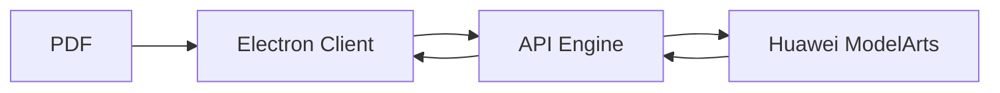

# Arquitectura Técnica

A continuación deberías añadir un diagrama (Mermaid) que muestre el flujo: PDF -> Electron -> API -> ModelArts -> Resultado.

Ejemplo (Mermaid):

(Expandir con detalles, dimensionamiento y decisiones de diseño.)
